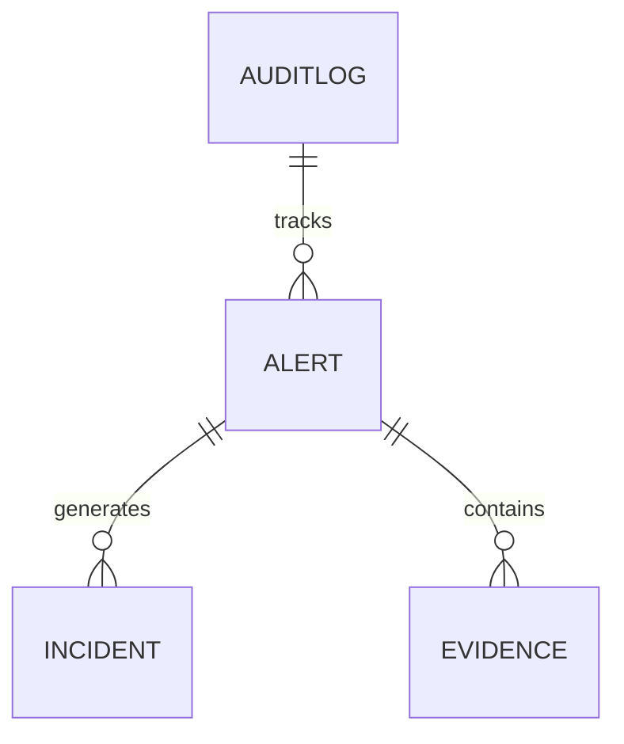

# Data Model Specification

## Conceptual Data Lifecycle
```text
Sensor → Observation → Detection → Track → Event → Alert → Incident → Evidence → Audit
```

## Current Entities (IMPLEMENTED)

### `Alert` (SQLAlchemy / Pydantic)
- `id`: UUID (Primary Key)
- `object_id`: String (Links back to track/observation)
- `scenario_id`: String (Links to simulation scenario)
- `priority_score`: Float (0-100)
- `band`: String (P1, P2, P3, P4)
- `latitude`: Float
- `longitude`: Float
- `altitude`: Float
- `speed`: Float
- `confidence`: Float (Honest uncertainty metric)
- `status`: String (NEW, ACKNOWLEDGED, ESCALATED, RESOLVED)

### `AuditLog` (SQLAlchemy)
- `id`: UUID
- `timestamp`: DateTime
- `actor`: String
- `action`: String
- `resource`: String *(NOTE: Bugged in current API routers as `entity_type`)*
- `resource_id`: String
- `previous_hash`: String (SHA-256 for integrity)
- `hash`: String (SHA-256 of current record)

### `Observation` (Pydantic / Simulation)
- `id`: UUID
- `simulation_id`: String
- `class_code`: String (e.g., drone, person, vehicle)
- `latitude`, `longitude`, `altitude`: Float
- `quality_score`: Float
- `is_synthetic`: Boolean (Always True)

## Proposed Entities (PROPOSED)

### `Incident` (SQLAlchemy)
- `id`: UUID
- `alert_id`: UUID (Foreign Key)
- `resolution_notes`: String
- `operator_id`: String

### `Evidence` (PROPOSED)
- `id`: UUID
- `alert_id`: UUID
- `synthetic_image_url`: String
- `radar_cross_section`: Float


