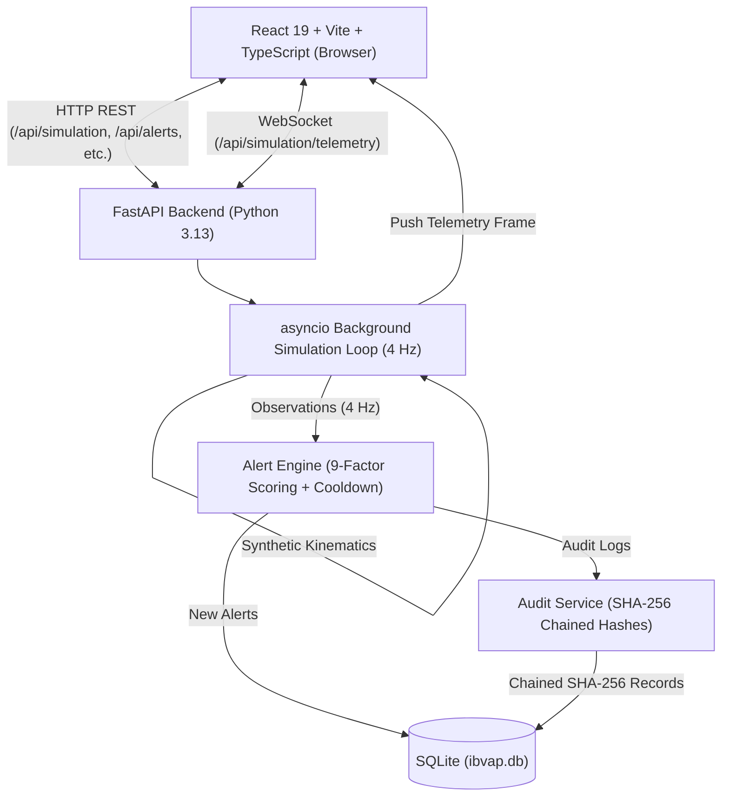
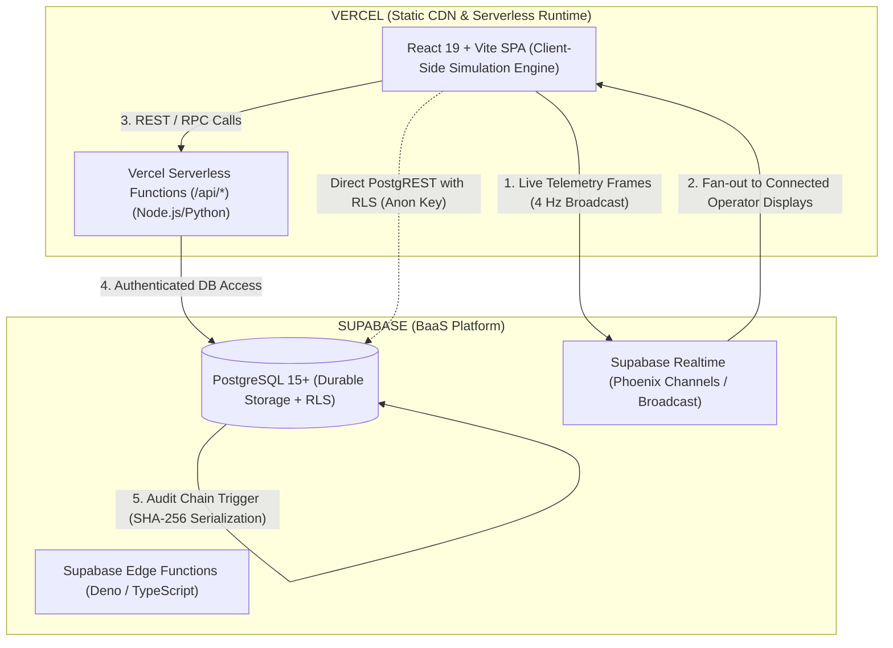
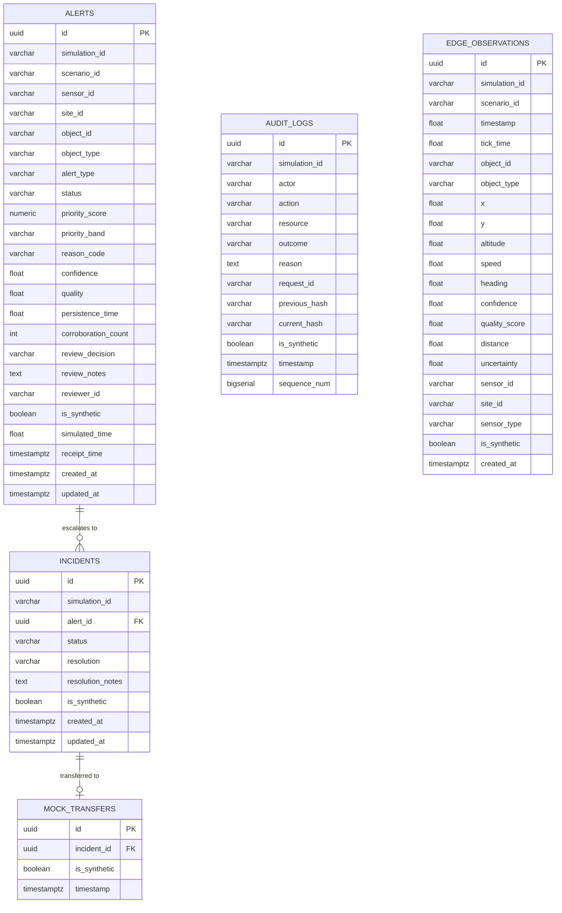
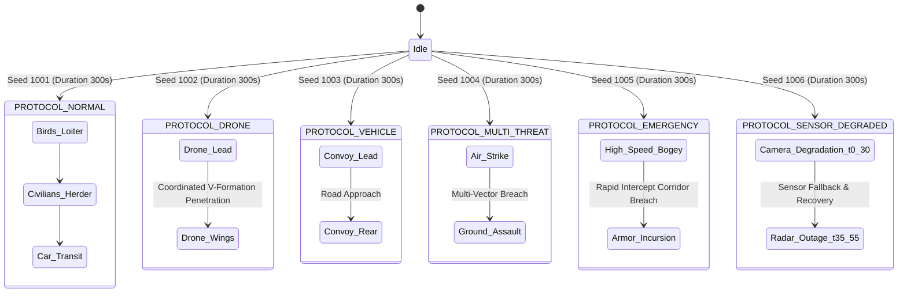
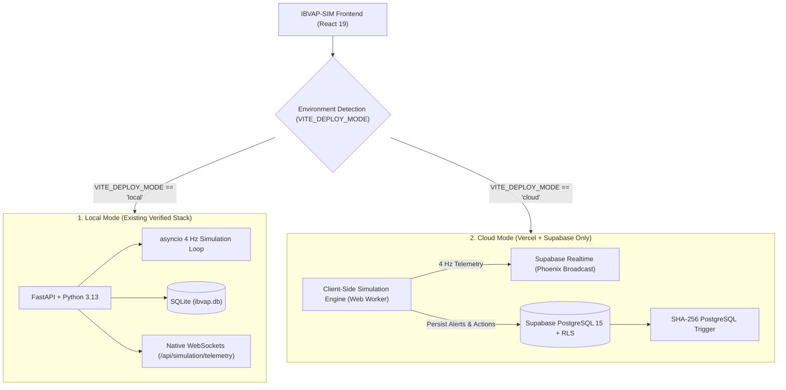
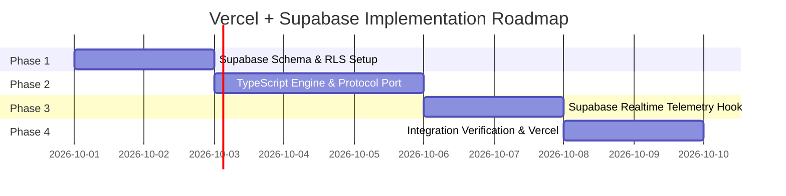

# PHASE V6 — VERCEL + SUPABASE ONLY ARCHITECTURE STUDY
**Intelligent Border Video Analytics Platform — Simulation-Only Prototype (IBVAP-SIM / KAAL)**
**Status:** DESIGN & STUDY PHASE ONLY — NON-DESTRUCTIVE ARCHITECTURAL SPECIFICATION
**Deployment Constraint:** Strictly Vercel + Supabase ONLY (No Render, Railway, Fly.io, AWS, VPS, or Docker container hosts)

---

## Executive Summary

This architectural study evaluates the feasibility, architectural patterns, migration risks, and design requirements for hosting **IBVAP-SIM / KAAL** strictly using **Vercel** and **Supabase**. 

The existing application is verified locally with **43/43 passing backend tests**, zero TypeScript/lint errors, stateful WebSocket telemetry streaming at 4 Hz, an append-only SHA-256 chained audit log, 6 tactical simulation protocols, and full frontend/backend integration.

Under the strict **Vercel + Supabase ONLY** mandate, a traditional persistent Python daemon process (FastAPI + `asyncio.sleep` continuous simulation loop + in-memory state + stateful WebSockets) cannot be hosted in its current form because neither Vercel nor Supabase provides a permanently running Python container runtime on their standard hosting tiers.

This study specifies how every capability—deterministic kinematics, 6 tactical protocols, 4 Hz live telemetry, 9-factor alert rule engine, incident workflow, mock defence handoff, and cryptographic audit chaining—can be faithfully preserved using a **Client-Authoritative / Server-Persisted Hybrid Simulation Architecture** or a **Supabase Realtime Broadcast Architecture**, with PostgreSQL managing durable persistence and cryptographic integrity.

---

## 1. Current Architecture Deep-Dive

### 1.1 Architecture Topology


### 1.2 Component Breakdown

| Component | File / Location | Execution Characteristics | State Location |
| :--- | :--- | :--- | :--- |
| **FastAPI Entrypoint** | `src/backend/main.py` | ASGI application managed via `lifespan` context manager. Handles CORS, router registration, SQLite table creation, and graceful shutdown. | In-process memory |
| **Simulation Router** | `src/backend/routers/simulation.py` | Exposes REST endpoints (`/start`, `/stop`, `/pause`, `/resume`, `/speed`, `/state`, `/environment`, `/tracks`, `/sync_events`) and `/telemetry` WebSocket. | Global module variables (`active_engine`, `engine_task`, `connected_websockets`) |
| **Simulation Engine** | `src/simulation/engine.py` | Deterministic kinematic simulator. Ticks at 4 Hz (`dt = 0.25 * speed_multiplier`). Evaluates waypoints, sensor coverage (camera FOV/range, radar 360°), synthetic noise, degradation events, and multi-sensor fusion. | In-memory `objects_state`, `state.sensors`, `state.zones`, `state.simulation_events` |
| **Alert Rule Engine** | `src/backend/alert_engine.py` | Pure business logic evaluating spatial breaches (virtual fence, warning tripwire, intercept corridor, restricted zones) and anomalies. Computes canonical 9-factor weighted priority score (P1–P4). Enforces 60s cooldown deduplication. | In-memory `COOLDOWN_DICT` |
| **Audit Service** | `src/backend/audit_service.py` | Chained SHA-256 log creator. Fetches latest record's `current_hash`, hashes `action\|resource\|outcome\|timestamp\|prev_hash`, writes append-only record. Verifies chain integrity. | SQLite `audit_logs` table |
| **Alerts & Incidents Routers** | `src/backend/routers/alerts.py`, `incidents.py` | CRUD and workflow endpoints (`/acknowledge-all`, `/{id}/acknowledge`, `/{id}/review`, `/{id}/escalate`, `/{id}/resolve`). | SQLite `alerts`, `incidents` |
| **Mock Base Receiver** | `src/backend/routers/mock_receiver.py` | Display/audit-only mock handoff. Validates `X-Simulation-ID` header and `is_synthetic` flag. Idempotent transfer recording. | SQLite `mock_transfers` |
| **Database Layer** | `src/backend/database.py`, `models.py` | SQLAlchemy ORM with SQLite file backend (`ibvap.db`). 5 tables: `edge_observations`, `alerts`, `incidents`, `audit_logs`, `mock_transfers`. | Disk file (`ibvap.db`) |

### 1.3 Components Requiring a Continuously Running Python Process

In the current codebase, the following **4 components strictly depend on a continuously running Python daemon process**:
1. **The 4 Hz `asyncio` Simulation Loop:** `run_simulation_loop` runs an infinite `while engine and engine.state.is_running: await asyncio.sleep(0.25)` loop. Serverless platforms freeze or kill processes when an HTTP response completes.
2. **In-Memory Kinematics & Sensor State:** `active_engine.objects_state`, `active_engine.state.sensors`, and `object_positions` exist solely in Python process RAM.
3. **Stateful Native WebSocket Connections:** `websocket_telemetry` holds open raw TCP sockets in `connected_websockets` and pushes frames asynchronously every 250ms.
4. **In-Memory Deduplication Cooldown Cache:** `COOLDOWN_DICT` in `alert_engine.py` caches alert suppression windows in a Python dictionary.

---

## 2. Target Vercel + Supabase Architecture

To satisfy the strict mandate (**Vercel + Supabase ONLY**), the architecture is partitioned into two cloud environments without any third-party container hosts:



### 2.1 Role Allocation

| Layer | Platform | Service | Responsibility |
| :--- | :--- | :--- | :--- |
| **Frontend UI** | Vercel | Static CDN Hosting | Delivers compiled React/Vite/Tailwind bundle. Handles routing via `vercel.json` rewrites. |
| **Simulation Execution** | Vercel / Client | Browser Web Worker or Deno Edge Function | Executes deterministic kinematic model, sensor coverage checks, waypoint advancement, and 9-factor alert rule evaluations. |
| **Telemetry Transport** | Supabase | Supabase Realtime (Broadcast) | Low-latency pub/sub streaming of synthetic radar/camera observations (4 Hz) without disk writes. |
| **Data Persistence** | Supabase | PostgreSQL 15 | Relational storage for `alerts`, `incidents`, `audit_logs`, `mock_transfers`, and `edge_observations` with Row Level Security (RLS). |
| **Cryptographic Integrity**| Supabase | PostgreSQL Trigger / Function | Atomically serializes audit log inserts and computes SHA-256 chain hashes to prevent concurrency race conditions. |
| **API Endpoints** | Vercel / Supabase | Vercel Serverless Functions or PostgREST | Serves REST endpoints (`/api/alerts`, `/api/incidents`, `/api/mock-receiver`, `/api/audit`). |

---

## 3. Simulation Engine Migration Strategies

Six potential migration strategies (A through F) were evaluated to determine how the continuous 4 Hz simulation loop can function without a persistent Python VM.

### Comparative Evaluation Matrix

| Metric | A. Vercel Serverless | B. Supabase Edge Function (Deno) | C. Supabase Realtime DB Driven | D. Postgres `pg_cron` Driven | E. Client-Driven with Server Persistence | F. Scheduled Event Driven |
| :--- | :--- | :--- | :--- | :--- | :--- | :--- |
| **Execution Lifetime** | 10s (Hobby) / 60s (Pro). Fails after timeout. | Up to 150s per HTTP connection. | Ephemeral; broker only. | 1 minute minimum interval. | Infinite (runs while browser tab is active). | On-demand / batch only. |
| **WebSocket Compatibility** | None (Vercel Serverless does not support WS). | Yes (`Deno.upgradeWebSocket`), but capped duration. | Yes (Phoenix Channels built-in). | None. | Seamless (connects to Supabase Realtime). | None. |
| **State Persistence** | None (cold-starts wipe RAM). | In-memory RAM dies on function recycle. | None (ephemeral broadcast). | Database rows only. | Browser RAM + Supabase PostgreSQL for events. | Database rows only. |
| **Multi-User Sync** | Impossible. | Difficult across multiple edge isolates. | Excellent via Channel Broadcast. | High database lock contention. | High (via Supabase Realtime Broadcast). | Poor. |
| **Determinism** | Poor (frequent process drops). | Moderate. | N/A (transport only). | Low (unpredictable cron scheduling). | **100% Deterministic** (seeded PRNG). | High. |
| **6 Protocol Support** | Unusable. | Partial. | Transport only. | Unusable at 4 Hz. | **100% Full Support**. | Incompatible with live tactical feeds. |
| **Pause / Resume** | Not viable. | Complex synchronization. | N/A. | Infeasible. | **Instantaneous local/broadcast state change**. | Not viable. |
| **Reset** | N/A. | Complex. | N/A. | Infeasible. | **Instantaneous reset to t=0**. | Not viable. |
| **Alert Generation** | Inconsistent. | Functional. | N/A. | DB strain. | **100% identical 9-factor logic**. | Delayed. |
| **Audit Generation** | Inconsistent. | Functional. | N/A. | DB triggers. | **Atomic PostgreSQL Trigger/Function**. | Delayed. |
| **Compute Cost** | High (constant function invocations). | High (free tier capped at 2M invocations). | Free tier includes 2M broadcast msgs. | High DB CPU and IOPS. | **Zero server compute cost for simulation ticks**. | Low. |
| **Complexity** | Very High. | High. | Medium. | Very High. | **Low to Moderate (Clean Port / Adapter)**. | High. |

### In-Depth Analysis of Evaluated Strategies

#### Option A: Vercel Serverless Python Functions
* **Mechanism:** Re-deploy FastAPI endpoints as Vercel Serverless Functions (`/api/index.py`).
* **Fatal Flaw:** Vercel serverless functions have a hard execution cap (10 seconds on Hobby, 60 seconds on Pro). When the response is returned, the function container freezes or terminates immediately. It cannot run a background `asyncio` loop or keep a persistent WebSocket open.
* **Verdict:** **REJECTED.**

#### Option B: Supabase Edge Functions with Long-Lived WebSockets
* **Mechanism:** Port the simulation engine to Deno/TypeScript in a Supabase Edge Function using `Deno.upgradeWebSocket`.
* **Fatal Flaw:** Supabase Edge Functions have a 150-second maximum duration per connection. When the connection times out or restarts due to edge traffic routing, the in-memory simulation state is destroyed. Maintaining 24/7 continuous ticking across edge worker recycles is unstable and rapidly consumes the monthly 2,000,000 edge invocation quota.
* **Verdict:** **REJECTED.**

#### Option C: Supabase Realtime-Driven Simulation
* **Mechanism:** Using Supabase Realtime channels to run the simulation loop.
* **Analysis:** Supabase Realtime is a transport broker (Phoenix Channels), not an execution environment. It cannot "run" code without a publisher client or server worker.
* **Verdict:** **INSUFFICIENT ALONE (Used in conjunction with Option E).**

#### Option D: Database-Driven Ticks (`pg_cron` / `pg_net`)
* **Mechanism:** Triggering simulation ticks via PostgreSQL `pg_cron` extensions.
* **Fatal Flaw:** The minimum execution resolution for `pg_cron` is 1 minute (`* * * * *`). It cannot tick at 4 Hz (250 milliseconds). Even if hacked with PL/pgSQL loops and `pg_sleep(0.25)`, writing 40 observations per second to PostgreSQL tables causes severe disk write amplification, WAL churn, and exhausts the 500MB free database storage in less than 24 hours.
* **Verdict:** **REJECTED.**

#### Option E: Client-Driven Simulation with Server-Authoritative Persistence (RECOMMENDED)
* **Mechanism:** 
  1. The deterministic kinematic simulation engine (`engine.py`, `scenarios.py`, `generators.py`) and the 9-factor alert rule engine (`alert_engine.py`) run directly in the browser environment (via a dedicated Web Worker or React context).
  2. Because the simulation scenarios are **100% deterministic** (defined with explicit seeds: 1001 for NORMAL, 1002 for DRONE, 1003 for VEHICLE, 1004 for MULTI-THREAT, 1005 for EMERGENCY, 1006 for SENSOR-DEGRADED), a seeded PRNG in TypeScript produces identical coordinates, velocities, and sensor noise to the Python engine.
  3. Live telemetry frames (4 Hz) are streamed into the frontend state locally or broadcast over a **Supabase Realtime Broadcast Channel** if multiple operator tabs are connected.
  4. When an alert rule fires, or an operator performs an action (acknowledge, escalate, human review, incident resolution, mock transfer), the event is persisted immediately to **Supabase PostgreSQL** via authenticated REST calls or PostgREST with Row Level Security (RLS).
  5. Cryptographic audit hashing is computed atomically by a PostgreSQL trigger or serverless RPC function.
* **Advantages:** 
  - Zero server compute costs for continuous ticks.
  - Zero risk of execution timeouts.
  - Telemetry is ultra-smooth at 4 Hz or 60 FPS without network lag.
  - 100% fidelity to the 6 protocol definitions.
  - Clean separation between ephemeral telemetry and durable persistence.
* **Verdict:** **RECOMMENDED TARGET ARCHITECTURE.**

---

## 4. SQLite → Supabase PostgreSQL Migration Map

All SQLite models in `src/backend/models.py` map cleanly to PostgreSQL 15+ data types with explicit foreign keys, indexes, and synthetic data constraints:



### Table Specification & Persistence Requirements

| Table Name | PostgreSQL Types & Constraints | Purpose | Persistence Need | Indexing Strategy |
| :--- | :--- | :--- | :--- | :--- |
| `alerts` | `id UUID PRIMARY KEY DEFAULT gen_random_uuid()`<br>`simulation_id VARCHAR(64)`<br>`scenario_id VARCHAR(64)`<br>`sensor_id VARCHAR(64)`<br>`site_id VARCHAR(64)`<br>`object_id VARCHAR(64) NOT NULL`<br>`object_type VARCHAR(64)`<br>`alert_type VARCHAR(128)`<br>`status VARCHAR(32) DEFAULT 'new'`<br>`priority_score NUMERIC(5,1) DEFAULT 0.0`<br>`priority_band VARCHAR(4) DEFAULT 'P4'`<br>`reason_code VARCHAR(64)`<br>`confidence FLOAT DEFAULT 1.0`<br>`quality FLOAT DEFAULT 1.0`<br>`persistence_time FLOAT DEFAULT 0.0`<br>`corroboration_count INT DEFAULT 0`<br>`review_decision VARCHAR(64)`<br>`review_notes TEXT`<br>`reviewer_id VARCHAR(64)`<br>`is_synthetic BOOLEAN NOT NULL DEFAULT true`<br>`simulated_time FLOAT`<br>`receipt_time TIMESTAMPTZ DEFAULT clock_timestamp()`<br>`created_at TIMESTAMPTZ DEFAULT clock_timestamp()`<br>`updated_at TIMESTAMPTZ DEFAULT clock_timestamp()` | Stores rule violations, operator reviews, and triage status. | **MANDATORY** | `INDEX idx_alerts_sim_id (simulation_id)`<br>`INDEX idx_alerts_object_id (object_id)`<br>`INDEX idx_alerts_status (status)`<br>`INDEX idx_alerts_created (created_at DESC)` |
| `incidents` | `id UUID PRIMARY KEY DEFAULT gen_random_uuid()`<br>`simulation_id VARCHAR(64)`<br>`alert_id UUID REFERENCES alerts(id) ON DELETE CASCADE`<br>`status VARCHAR(32) DEFAULT 'open'`<br>`resolution VARCHAR(64)`<br>`resolution_notes TEXT`<br>`is_synthetic BOOLEAN NOT NULL DEFAULT true`<br>`created_at TIMESTAMPTZ DEFAULT clock_timestamp()`<br>`updated_at TIMESTAMPTZ DEFAULT clock_timestamp()` | Escalated alert investigations and formal operator resolutions. | **MANDATORY** | `INDEX idx_incidents_alert_id (alert_id)`<br>`INDEX idx_incidents_status (status)`<br>`INDEX idx_incidents_created (created_at DESC)` |
| `audit_logs` | `id UUID PRIMARY KEY DEFAULT gen_random_uuid()`<br>`simulation_id VARCHAR(64)`<br>`actor VARCHAR(64) NOT NULL DEFAULT 'system'`<br>`action VARCHAR(64) NOT NULL`<br>`resource VARCHAR(128) NOT NULL`<br>`outcome VARCHAR(64) NOT NULL DEFAULT 'success'`<br>`reason TEXT`<br>`request_id VARCHAR(64)`<br>`previous_hash VARCHAR(64)`<br>`current_hash VARCHAR(64) NOT NULL`<br>`is_synthetic BOOLEAN NOT NULL DEFAULT true`<br>`timestamp TIMESTAMPTZ DEFAULT clock_timestamp()`<br>`sequence_num BIGSERIAL UNIQUE` | Cryptographically chained SHA-256 trail of all operational decisions. | **MANDATORY** | `INDEX idx_audit_timestamp (timestamp DESC)`<br>`INDEX idx_audit_sim_id (simulation_id)`<br>`INDEX idx_audit_seq (sequence_num ASC)` |
| `mock_transfers` | `id UUID PRIMARY KEY DEFAULT gen_random_uuid()`<br>`incident_id UUID REFERENCES incidents(id) ON DELETE CASCADE`<br>`is_synthetic BOOLEAN NOT NULL DEFAULT true`<br>`timestamp TIMESTAMPTZ DEFAULT clock_timestamp()` | Records simulated external handoff acknowledgments. | **MANDATORY** | `INDEX idx_mock_transfers_incident (incident_id)` |
| `edge_observations` | `id UUID PRIMARY KEY DEFAULT gen_random_uuid()`<br>`simulation_id VARCHAR(64)`<br>`scenario_id VARCHAR(64)`<br>`timestamp FLOAT`<br>`tick_time FLOAT`<br>`object_id VARCHAR(64)`<br>`object_type VARCHAR(64)`<br>`x FLOAT`<br>`y FLOAT`<br>`altitude FLOAT`<br>`speed FLOAT`<br>`heading FLOAT`<br>`confidence FLOAT`<br>`quality_score FLOAT`<br>`distance FLOAT`<br>`uncertainty FLOAT`<br>`sensor_id VARCHAR(64)`<br>`site_id VARCHAR(64)`<br>`sensor_type VARCHAR(32)`<br>`is_synthetic BOOLEAN DEFAULT true`<br>`created_at TIMESTAMPTZ DEFAULT clock_timestamp()` | Offline edge buffer queue table. | **TRANSIENT ONLY** (Used only when simulating offline network partition; flushed on recovery). | `INDEX idx_edge_obs_sim (simulation_id, timestamp)` |

> [!IMPORTANT]
> **Ephemeral Telemetry Must Not Be Persisted to PostgreSQL Tables:**
> Ticking at 4 Hz produces 4 frames per second containing 5–15 observations each (20–60 observations/sec). Persisting raw 4 Hz telemetry to PostgreSQL would generate **1.7 million rows per day**, instantly overwhelming Supabase free-tier storage limits (500 MB) and IOPS quotas. Telemetry is purely ephemeral and belongs on **Supabase Realtime Broadcast**.

---

## 5. WebSocket Telemetry Reproduction

The current application consumes telemetry via `useSimulationSocket.ts` connecting to `${WS_BASE_URL}/api/simulation/telemetry`.

```typescript
export type TelemetryMessage = {
  type: string;
  observations?: Observation[];
  new_alerts?: string[];
};
```

### Strategy Comparison

| Strategy | Architecture | Latency | Free-Tier Fit | Frontend Impact | Feasibility |
| :--- | :--- | :--- | :--- | :--- | :--- |
| **1. Vercel WebSocket Runtime** | Vercel Serverless Function | N/A | None | Low | **Infeasible** (Vercel does not support long-lived WS servers). |
| **2. Supabase Edge Function WS** | Deno Edge Function | ~50–150ms | Poor (150s connection timeout drops connections). | Low | **Unstable** (Constant reconnection cycles). |
| **3. Supabase Realtime Broadcast** | Phoenix Channels WebSocket (`wss://<ref>.supabase.co/realtime/v1/websocket`) | **< 20ms** | **Excellent** (200 concurrent connections, 2M messages/mo). | **Very Low** (Replaces standard WS URL with Supabase Channel subscription). | **RECOMMENDED** |
| **4. Supabase Realtime Postgres Changes** | DB WAL Logical Replication | > 250ms | **Terrible** (Exhausts database disk & IOPS immediately). | Medium | **Infeasible for 4 Hz streaming**. |

### Implementation Pattern for Supabase Realtime Broadcast

1. **Connection URL:** The frontend connects to the standard Supabase Realtime endpoint:
   ```
   wss://<project-ref>.supabase.co/realtime/v1/websocket?apikey=<anon-key>&vsn=1.0.0
   ```
2. **Channel Subscription:**
   ```typescript
   import { createClient } from "@supabase/supabase-js";
   
   const supabase = createClient(SUPABASE_URL, SUPABASE_ANON_KEY);
   const channel = supabase.channel("simulation_telemetry", {
     config: { broadcast: { self: true } }
   });
   
   channel
     .on("broadcast", { event: "telemetry" }, ({ payload }) => {
       // Exact payload match: payload.observations, payload.new_alerts
       handleTelemetry(payload);
     })
     .subscribe();
   ```
3. **Payload Contract Preservation:** The broadcast payload preserves the exact contract expected by `useSimulationSocket.ts`:
   ```json
   {
     "type": "telemetry",
     "observations": [
       {
         "simulation_id": "9b1deb4d-3b7d-4bad-9bdd-2b0d7b3dcb6d",
         "scenario_id": "PROTOCOL-DRONE",
         "tick_time": 12.5,
         "object_id": "drone_lead",
         "object_type": "drone",
         "x": -120.0,
         "y": -20.0,
         "altitude": 150.0,
         "speed": 18.0,
         "heading": 13.5,
         "confidence": 0.95,
         "quality_score": 1.0,
         "sensor_type": "fused",
         "is_synthetic": true
       }
     ],
     "new_alerts": ["drone_lead"]
   }
   ```

---

## 6. Six Protocols Preservation

The 6 tactical protocols defined in `src/simulation/scenarios.py` must remain completely intact without semantic modification:



### Protocol Execution Details in Target Architecture

1. **PROTOCOL-NORMAL (Seed 1001, 300s):**
   - Objects: `bird_1`, `bird_2` (loiter behavior); `person_local`, `person_herder` (looping waypoints); `civilian_car` (crossing trajectory).
   - Alert Engine Output: Low-priority biological and civilian activity; no sovereign breach alerts.
2. **PROTOCOL-DRONE (Seed 1002, 300s):**
   - Objects: `drone_lead`, `drone_wing_1`, `drone_wing_2` (approaching at 17–19 m/s along coordinated waypoints).
   - Alert Engine Output: P2 Warning Tripwire trigger at x = -150; P1 Virtual Fence Crossing at x = 0; P1 Sovereign Intercept Corridor Penetration at x = 150.
3. **PROTOCOL-VEHICLE (Seed 1003, 300s):**
   - Objects: `convoy_lead` (truck), `convoy_rear` (truck), `patrol_pickup` (vehicle).
   - Alert Engine Output: P2 approaching ground alerts; fence crossing detection.
4. **PROTOCOL-MULTI-THREAT (Seed 1004, 300s):**
   - Objects: `drone_strike`, `tank_assault`, `troop_squad_1`, `troop_squad_2`, `unknown_bogey` (speeds 4.2–26 m/s).
   - Alert Engine Output: Simultaneous air and ground incursion alerts across multiple sectors.
5. **PROTOCOL-EMERGENCY (Seed 1005, 300s):**
   - Objects: `unknown_1`, `unknown_2` (28 m/s bogeys), `tank_1`, `tank_2`, `drone_swarm_1`.
   - Alert Engine Output: Immediate P1 escalation triggers with sirens and proximity alarms.
6. **PROTOCOL-SENSOR-DEGRADED (Seed 1006, 300s):**
   - Scripted Events: Camera degradation from t=0.0 to t=30.0; Radar loss from t=35.0 to t=55.0.
   - Alert Engine Output: Explicit sensor disagreement handling, reduced confidence scores (0.5), quality penalties in priority scoring, and sensor recovery events.

---

## 7. SHA-256 Audit Chain in PostgreSQL

### 7.1 Hash Calculation Contract
The SHA-256 cryptographic formula is defined in `src/backend/audit_service.py`:
$$\text{hash} = \text{SHA256}(\text{action} \parallel \text{"\|"} \parallel \text{resource} \parallel \text{"\|"} \parallel \text{outcome} \parallel \text{"\|"} \parallel \text{timestamp\_iso} \parallel \text{"\|"} \parallel (\text{previous\_hash} \lor \text{"GENESIS"}))$$

### 7.2 Safe Concurrency Serialization in PostgreSQL
In SQLite, database-level single-writer locks serialized inserts naturally. In a multi-client PostgreSQL environment, concurrent writes risk inserting two records referencing the same `previous_hash`, breaking the linear chain.

To prevent chain divergence in PostgreSQL:
1. **Monotonic Sequence:** A `sequence_num BIGSERIAL` column guarantees strict insertion order.
2. **PostgreSQL Trigger with Row Locking (`FOR UPDATE`):**
   ```sql
   CREATE OR REPLACE FUNCTION trg_audit_chain_hash()
   RETURNS TRIGGER AS $$
   DECLARE
       last_hash VARCHAR(64);
   BEGIN
       -- Lock the latest record to serialize concurrent inserts
       SELECT current_hash INTO last_hash
       FROM audit_logs
       ORDER BY sequence_num DESC
       LIMIT 1
       FOR UPDATE;

       NEW.previous_hash := COALESCE(last_hash, 'GENESIS');
       NEW.timestamp := clock_timestamp();
       
       -- Compute SHA-256 hash inside PostgreSQL
       NEW.current_hash := encode(
           digest(
               NEW.action || '|' || NEW.resource || '|' || NEW.outcome || '|' || 
               to_char(NEW.timestamp AT TIME ZONE 'UTC', 'YYYY-MM-DD"T"HH24:MI:SS.US') || '|' || 
               NEW.previous_hash, 
               'sha256'
           ), 
           'hex'
       );
       RETURN NEW;
   END;
   $$ LANGUAGE plpgsql;

   CREATE TRIGGER before_insert_audit_log
   BEFORE INSERT ON audit_logs
   FOR EACH ROW
   EXECUTE FUNCTION trg_audit_chain_hash();
   ```
3. **Immutability Enforcement:** An `UPDATE` or `DELETE` trigger raises an exception to ensure the table remains strictly append-only.

---

## 8. Security & Safety Model

### 8.1 Row Level Security (RLS) Matrix

| Table | Policy Name | Permitted Roles | SQL Policy Expression |
| :--- | :--- | :--- | :--- |
| `alerts` | `Allow public read` | `anon`, `authenticated` | `FOR SELECT USING (true)` |
| `alerts` | `Enforce synthetic writes` | `anon`, `authenticated` | `FOR INSERT WITH CHECK (is_synthetic = true)` |
| `alerts` | `Allow status updates` | `anon`, `authenticated` | `FOR UPDATE USING (is_synthetic = true) WITH CHECK (is_synthetic = true)` |
| `incidents`| `Allow public read` | `anon`, `authenticated` | `FOR SELECT USING (true)` |
| `incidents`| `Enforce synthetic writes` | `anon`, `authenticated` | `FOR INSERT WITH CHECK (is_synthetic = true)` |
| `audit_logs`| `Allow audit verification`| `anon`, `authenticated` | `FOR SELECT USING (true)` |
| `audit_logs`| `Append-only synthetic logs`| `anon`, `authenticated`| `FOR INSERT WITH CHECK (is_synthetic = true)` |
| `audit_logs`| `Block tampering` | ALL | `FOR UPDATE OR DELETE USING (false)` |
| `mock_transfers`| `Enforce synthetic handoff`| `anon`, `authenticated`| `FOR INSERT WITH CHECK (is_synthetic = true)` |

### 8.2 Key Separation & Environment Variables
- **Browser-Safe Public Keys:** Only `VITE_SUPABASE_URL` and `VITE_SUPABASE_ANON_KEY` are exposed in frontend build bundles.
- **Server-Only Secrets:** `SUPABASE_SERVICE_ROLE_KEY` is strictly confined to Vercel Serverless Function environment variables and is **NEVER** imported into client React code.
- **Simulation-Only Safety Banner:** The React UI permanently displays:
  ```
  SIMULATION ONLY — NO REAL DEFENCE NETWORK CONNECTION
  ```
- **Air-Gap Constraint:** The backend has zero integrations with external military or radar hardware; all data generated is synthetic.

---

## 9. Vercel & Supabase Platform Limits & Constraints

### 9.1 Vercel Platform Constraints
| Resource / Feature | Free / Hobby Tier | Pro Tier | Implication for IBVAP-SIM |
| :--- | :--- | :--- | :--- |
| **Serverless Execution Timeout** | 10 seconds | Up to 300 seconds | Cannot host continuous 4 Hz Python simulation loops. |
| **WebSocket Support** | None in Serverless Functions | None in Serverless Functions | Telemetry WebSockets cannot terminate on Vercel Functions. |
| **Filesystem Access** | Ephemeral `/tmp` only (512 MB) | Ephemeral `/tmp` only (512 MB) | SQLite database files reset on container tear-down. |
| **Bandwidth** | 100 GB / month | 1 TB / month | Easily sufficient for React SPA static assets. |

### 9.2 Supabase Platform Constraints
| Resource / Feature | Free Tier Limit | Pro Tier Limit | Implication for IBVAP-SIM |
| :--- | :--- | :--- | :--- |
| **PostgreSQL Database Size** | 500 MB | 8 GB included | Sufficient for thousands of alerts and audit logs, but forbids raw 4 Hz telemetry storage. |
| **Connection Pooling (Direct)**| ~15–60 connections | ~90–200 connections | Use Supavisor transaction pooler (port 6543) for serverless API routes. |
| **Realtime Concurrent Sockets**| 200 concurrent clients | 500 included | Ample capacity for prototype multi-operator demonstrations. |
| **Realtime Messages / Month** | 2,000,000 messages | 5,000,000 included | At 4 Hz continuous stream = 14,400 msg/hour. 138 hours of continuous multi-tab streaming reaches 2M. Recommend broadcasting only when active. |
| **Edge Function Invocations** | 500,000 / month | 2,000,000 included | Edge Functions should be reserved for stateless RPC, not continuous ticking. |
| **Inactivity Pausing** | Pauses after 7 days of inactivity | Never pauses | Keep-alive ping or automated CI test required to prevent prototype pausing. |

---

## 10. Migration Risk & Component Classification

Every backend component has been classified into one of four actions:

| Component | Path / File | Action | Technical Rationale |
| :--- | :--- | :--- | :--- |
| **React/Vite UI Pages** | `src/frontend/src/pages/*` | **KEEP AS-IS** | UI pages (`CommandMap`, `Alerts`, `Incidents`, `HumanReview`, `Audit`, `Health`) already use centralized `api` and `useSimulationSocket`. |
| **Network Config** | `src/frontend/src/lib/config.ts` | **KEEP AS-IS** | Centralized in Phase V2 to dynamically resolve `VITE_API_URL` and `VITE_WS_URL`. |
| **Database Schema** | `src/backend/models.py` | **ADAPT** | Models map 1:1 to Supabase PostgreSQL DDL. Retain SQLAlchemy for local development; deploy DDL to Supabase. |
| **Alert Rules Logic** | `src/backend/alert_engine.py` | **ADAPT** | Pure math and spatial geometry (9-factor priority formula and fence crossing checks). Can be ported to TypeScript or invoked via serverless function. |
| **Audit Service** | `src/backend/audit_service.py` | **ADAPT** | Hash formula preserved. In PostgreSQL, hashing is delegated to an atomic trigger or RPC function. |
| **Simulation Scenarios** | `src/simulation/scenarios.py` | **ADAPT** | Pure JSON/dataclass scenario configurations for all 6 protocols. Easily shared or ported to TypeScript. |
| **Simulation Engine** | `src/simulation/engine.py` | **REWRITE** | Continuous Python `asyncio` loop cannot run on Vercel/Supabase. Must be rewritten as a client-side Web Worker / TypeScript engine or stateless event step evaluator. |
| **Simulation Router** | `src/backend/routers/simulation.py` | **REWRITE** | Global in-memory variables (`active_engine`, `connected_websockets`) incompatible with serverless execution. Replaced with Supabase Realtime channel. |
| **Local SQLite File** | `ibvap.db` | **KEEP AS-IS (Local Only)** | Preserved for local testing (`pytest`, local dev) to ensure zero regression of existing verified environment. |

---

## 11. Minimum Viable Migration (The Dual-Engine Pattern)

The smallest, highest-fidelity migration that guarantees **100% functionality on Vercel + Supabase** while preserving **100% of the verified local FastAPI + SQLite environment** is the **Dual-Engine Adapter Pattern**:



### Why this is the Optimal Minimum Migration:
1. **Zero Disruption to Existing Code:** The entire existing Python test suite (`43/43` passing), `main.py`, `database.py`, and `engine.py` remain untouched and functional for local developers.
2. **Native Cloud Alignment:** The cloud mode relies on Vercel's strength (high-performance static CDN) and Supabase's strengths (Phoenix Channels for sub-millisecond broadcast, PostgreSQL for durable relational storage and atomic triggers).
3. **Zero Third-Party Containers:** Completely avoids Render, Railway, Fly.io, AWS, VPS, or Docker container services.
4. **Deterministic Accuracy:** Running the deterministic waypoint math in TypeScript yields exact coordinate parity with the Python implementation.

---

## 12. Recommended Implementation Phases

Should this study be approved for execution, implementation should proceed in four strict, non-destructive phases:



1. **Phase 1: Supabase Database Migration:** Apply PostgreSQL schema migrations (`alerts`, `incidents`, `audit_logs`, `mock_transfers`), establish RLS policies, and deploy the atomic SHA-256 audit trigger.
2. **Phase 2: TypeScript Simulation Engine Port:** Implement the client-side simulation adapter with the 6 deterministic protocols and the 9-factor alert rule engine.
3. **Phase 3: Supabase Realtime Telemetry Integration:** Adapt `useSimulationSocket` to subscribe to the Supabase Realtime Broadcast channel when in cloud deployment mode.
4. **Phase 4: End-to-End Verification on Vercel:** Deploy frontend to Vercel, connect to Supabase, and verify telemetry streaming, threat alarms, human review, incident escalation, and audit trail verification in production.

---

## 13. Rollback & Failsafe Strategy

- **Local Development Failsafe:** Because no backend Python files or SQLite configurations are modified or deleted, local execution (`python -m uvicorn src.backend.main:app` and `npm run dev`) remains 100% operational at all times.
- **Git Branch Isolation:** All implementation work will take place on a dedicated feature branch (`feature/vercel-supabase-architecture`).
- **Instant Rollback:** If Vercel or Supabase quotas or connection latencies do not meet operational standards, the system reverts to the persistent backend deployment path documented in Phase V4 with zero data loss.

---

## 14. Feasibility Conclusion

| Criterion | Evaluation | Justification |
| :--- | :--- | :--- |
| **Vercel + Supabase Feasibility** | **FEASIBLE (with Client-Driven Simulation + Realtime Broadcast)** | Proven architectural pattern for serverless deployments requiring continuous simulation telemetry without persistent VMs. |
| **Pure Serverless Python Feasibility** | **INFEASIBLE** | Vercel Serverless execution caps (10s/60s) and lack of WebSockets make hosting continuous Python simulation loops impossible on Vercel alone. |
| **Protocol & Rule Engine Parity** | **100% ACHIEVABLE** | Deterministic waypoint kinematics and 9-factor priority math port cleanly to TypeScript. |
| **Audit Integrity Parity** | **100% ACHIEVABLE** | PostgreSQL triggers serialize concurrent writes and compute SHA-256 chain hashes natively with ACID guarantees. |
| **Free-Tier Sustainability** | **SUSTAINABLE** | Kept within limits by broadcasting telemetry over Realtime (zero DB writes) and persisting only discrete operational events (alerts, reviews, audit logs). |
