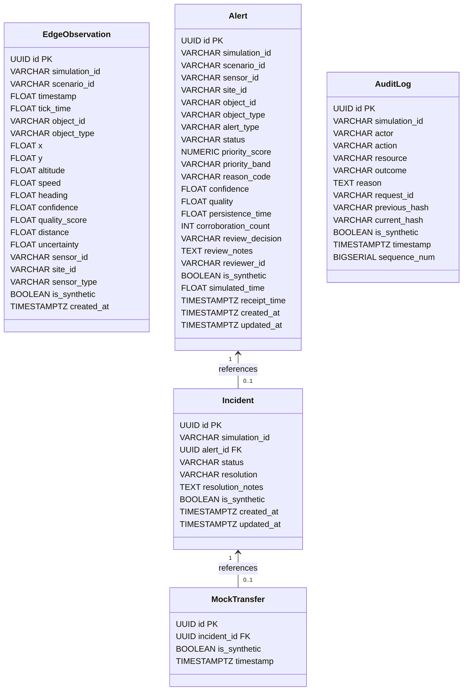

# PHASE V6A — SUPABASE READ-ONLY PROJECT AUDIT
**Project:** Intelligent Border Video Analytics Platform — Simulation-Only Prototype (IBVAP-SIM / KAAL)  
**Audit Date:** 2026-09-24  
**Status:** READ-ONLY AUDIT COMPLETE — NON-DESTRUCTIVE  
**Scope:** Supabase Project Discovery, Repository Integration Inspection, and Migration Mapping

---

## 1. Supabase Project Availability

### Discovery Execution
An automated discovery query was executed via the project's integrated Supabase Model Context Protocol (MCP) server (`supabase:list_projects`).

* **Result:** **UNAUTHORIZED / NOT AUTHENTICATED**
  ```
  Error: server name supabase failed to load: calling "initialize": sending "initialize": Unauthorized
  ```
* **Status Statement:**
  > **NO SUPABASE PROJECT AVAILABLE — STOP BEFORE CREATION.**

* **Local Supabase CLI Detection:**
  * Executed `which supabase`: **Not found in system PATH**.
  * Executed environment check for Supabase tokens (`SUPABASE_ACCESS_TOKEN`, `SUPABASE_KEY`): **None present**.
  * Local configuration file found: `supabase/config.toml` (created during initial project scaffolding with project name `"New_IBVAP"`, but without an active linked cloud project or local Docker daemon running).

---

## 2. Project Metadata

| Metadata Field | Status / Value |
| :--- | :--- |
| **Active Supabase Project** | **None available / Unauthenticated** |
| **Project Reference ID** | N/A |
| **Organization** | N/A |
| **Region** | N/A |
| **PostgreSQL Version Target** | PostgreSQL 15+ (Local `config.toml` specifies major_version = 17) |
| **Database Status** | Inaccessible via remote API |

---

## 3. Existing Schema & Database Inventory

Because no Supabase remote project is authenticated or accessible:
* **Remote Schemas:** Unreachable.
* **Remote Tables:** Unreachable.
* **Remote Indexes & Constraints:** Unreachable.
* **Remote RLS Policies:** Unreachable.
* **Existing Migration Scripts:** Inspected `supabase/` directory; no SQL migration files exist (`supabase/migrations/` is empty / nonexistent).

---

## 4. Existing Repository Supabase Integration

A thorough static analysis of the repository was performed:

### 4.1 Frontend Dependencies (`src/frontend/package.json`)
* **Supabase Client Library (`@supabase/supabase-js`):** **NOT INSTALLED**.
* Current dependencies: React 19, Vite 8, TypeScript 6, Tailwind CSS, Three.js, Lucide-react, Axios, MapLibre-GL.

### 4.2 Backend Dependencies (`requirements.txt`)
* **Python Supabase SDK (`supabase`):** **NOT INSTALLED**.
* **PostgreSQL Drivers (`psycopg2`, `asyncpg`):** **NOT INSTALLED**.
* Current dependencies: `fastapi[standard]`, `pydantic>=2.8.0`, `sqlalchemy`, `pytest>=8.0.0`, `httpx`, `pytest-asyncio`.

### 4.3 Environment Variables
* **Backend (`.env.example`):** Defines only `PORT`, `HOST`, `DATABASE_URL` (defaults to `sqlite:///./ibvap.db`), and `ALLOWED_ORIGINS`.
* **Frontend (`src/frontend/.env.example`):** Defines only `VITE_API_URL` and `VITE_WS_URL`.
* **Missing Cloud Keys:** Neither `VITE_SUPABASE_URL`, `VITE_SUPABASE_ANON_KEY`, nor `SUPABASE_SERVICE_ROLE_KEY` are currently configured or present in template files.

### 4.4 Codebase References
* `src/backend/database.py`: Contains a reference comment: `# In production, this would be an asyncpg connection string to Supabase PostgreSQL`.
* `supabase/config.toml`: Contains standard local CLI configuration for `project_id = "New_IBVAP"` (ports 54321 for API, 54322 for DB), but is currently inactive.
* `docs/ADR/ADR-014-supabase-adoption.md`: Architectural Decision Record dated 2026-09-13 declaring Supabase adoption as `PROPOSED` but deferred to maintain prototype stability.

---

## 5. SQLite → Supabase PostgreSQL Migration Mapping

The current data model is defined in [`src/backend/models.py`](file:///Users/sayanmondal/Documents/PROJECTS%20%E2%9C%85/Border_security/New%20IBVAP/src/backend/models.py). The proposed mapping to Supabase PostgreSQL is detailed below:



### Detailed Field & Constraint Specification

| Current SQLite Entity | Proposed Supabase/PostgreSQL Table | Primary Key | Key Columns & Types | Relationships | RLS Policy Requirement | Realtime Requirement | Persistence Priority |
| :--- | :--- | :--- | :--- | :--- | :--- | :--- | :--- |
| **`EdgeObservation`** | `edge_observations` | `id UUID DEFAULT gen_random_uuid()` | `simulation_id VARCHAR`, `object_id VARCHAR`, `x FLOAT`, `y FLOAT`, `confidence FLOAT`, `is_synthetic BOOLEAN DEFAULT true` | None | Read/Write authenticated or anon with synthetic check | None | **Low / Transient** (Only buffered during offline partition test; purged upon network restoration) |
| **`Alert`** | `alerts` | `id UUID DEFAULT gen_random_uuid()` | `object_id VARCHAR NOT NULL`, `alert_type VARCHAR`, `status VARCHAR DEFAULT 'new'`, `priority_score NUMERIC(5,1)`, `priority_band VARCHAR(4)`, `is_synthetic BOOLEAN DEFAULT true` | Escalates to `incidents.alert_id` | Read all; Write with `is_synthetic = true` | Realtime Postgres Changes (or Broadcast notification) | **High / Mandatory** (Core surveillance intelligence records) |
| **`Incident`** | `incidents` | `id UUID DEFAULT gen_random_uuid()` | `alert_id UUID REFERENCES alerts(id)`, `status VARCHAR DEFAULT 'open'`, `resolution VARCHAR`, `is_synthetic BOOLEAN DEFAULT true` | Belongs to `Alert`; Transferred to `MockTransfer` | Read all; Update with `is_synthetic = true` | Realtime Postgres Changes | **High / Mandatory** (Formal operator investigation record) |
| **`AuditLog`** | `audit_logs` | `id UUID DEFAULT gen_random_uuid()` | `actor VARCHAR`, `action VARCHAR`, `resource VARCHAR`, `outcome VARCHAR`, `previous_hash VARCHAR(64)`, `current_hash VARCHAR(64) NOT NULL`, `sequence_num BIGSERIAL UNIQUE` | None | Read all; Append-only insert with `is_synthetic = true`; No Update/Delete | None (Queried on demand) | **High / Mandatory** (Cryptographic audit integrity) |
| **`MockTransfer`** | `mock_transfers` | `id UUID DEFAULT gen_random_uuid()` | `incident_id UUID REFERENCES incidents(id)`, `is_synthetic BOOLEAN DEFAULT true`, `timestamp TIMESTAMPTZ` | Belongs to `Incident` | Insert only with `is_synthetic = true` | None | **High / Mandatory** (Simulated external handoff log) |

---

## 6. Persistent vs. Ephemeral Data Classification

A critical distinction must be enforced to ensure performance, compliance with the safety constitution, and adherence to Supabase free-tier storage quotas (500 MB limit):

### Category A: Persistent Data (PostgreSQL Durable Storage)
1. **Threat Alerts (`alerts`):** Persisted when a 9-factor spatial/temporal rule violation occurs. Average volume: 10–50 rows per simulation protocol.
2. **Operator Incidents (`incidents`):** Persisted upon alert escalation and formal operator triage.
3. **Audit Trail (`audit_logs`):** Append-only cryptographically chained SHA-256 logs of all sensitive operator actions.
4. **Mock External Transfers (`mock_transfers`):** Records of simulated Base/Army handoffs.
5. **Transient Edge Offline Queue (`edge_observations`):** Temporarily stored only when testing an edge network disconnection; bulk-flushed and deleted upon recovery.

### Category B: Ephemeral Data (Supabase Realtime Broadcast / Memory ONLY)
1. **4 Hz Raw Sensor Observations:** Camera FOV points, radar sweep points, and noisy synthetic coordinates (4 frames/sec $\times$ 5–15 objects = 20–60 observations/sec).
   * **STRICT RULE:** **NEVER persist raw 4 Hz telemetry ticks to PostgreSQL tables.** Writing continuous telemetry would generate over **1.7 million rows per day**, exhausting Supabase database storage and disk IOPS within hours.
2. **Current Object Kinematics:** Instantaneous heading, speed, waypoint index, and loitering states.
3. **Active Audio Alarm Loops:** Client-side tone synthesis and siren toggles.

---

## 7. Realtime Transport Requirements

To replace the existing `/api/simulation/telemetry` native FastAPI WebSocket:

1. **Mechanism:** Use **Supabase Realtime Broadcast** (Phoenix Channels WebSocket) over `wss://<project-ref>.supabase.co/realtime/v1/websocket`.
2. **Contract Preservation:** Broadcast messages must match the exact schema expected by [`useSimulationSocket.ts`](file:///Users/sayanmondal/Documents/PROJECTS%20%E2%9C%85/Border_security/New%20IBVAP/src/frontend/src/hooks/useSimulationSocket.ts#L26-L30):
   ```json
   {
     "type": "telemetry",
     "observations": [
       {
         "simulation_id": "string",
         "scenario_id": "string",
         "tick_time": 10.5,
         "object_id": "drone_lead",
         "object_type": "drone",
         "x": -150.2,
         "y": 45.0,
         "altitude": 120.0,
         "speed": 18.0,
         "heading": 85.0,
         "confidence": 0.95,
         "quality_score": 1.0,
         "sensor_type": "fused",
         "is_synthetic": true
       }
     ],
     "new_alerts": ["drone_lead"]
   }
   ```
3. **Bandwidth / Quota Management:** Supabase free tier provides **2,000,000 Realtime messages/month**. At 4 Hz, an active simulation consumes 14,400 messages/hour. The client-side telemetry loop must pause broadcasting when the browser tab is hidden (`document.visibilityState === "hidden"`) or the simulation is paused.

---

## 8. Security & Row Level Security (RLS) Strategy

1. **Simulation-Only Integrity:**
   * Every table definition must include:
     ```sql
     is_synthetic BOOLEAN NOT NULL DEFAULT true
     ```
   * RLS `WITH CHECK (is_synthetic = true)` ensures no operational data can ever be inserted.
2. **Audit Immutability:**
   * Table `audit_logs` must have RLS or a PostgreSQL trigger forbidding `UPDATE` and `DELETE` actions under all circumstances.
3. **Key Separation:**
   * Browser bundles ONLY receive `VITE_SUPABASE_ANON_KEY`.
   * `SUPABASE_SERVICE_ROLE_KEY` is reserved strictly for backend administration and must never be exposed to the client.

---

## 9. Verification of Architecture Assumptions & Current Code Conflicts

| Target Architecture Expectation | Current Repository State | Conflict / Gap | Resolution Path |
| :--- | :--- | :--- | :--- |
| **Vercel: React/Vite Frontend** | `src/frontend` builds cleanly in 954ms; routing configured via `vercel.json`. | None. | Keep as-is. |
| **Vercel: Client-Side Simulation Web Worker** | Simulation logic exists in Python (`src/simulation/engine.py`). | Current simulation loop requires continuous Python runtime. | Port deterministic kinematics to a client-side TypeScript Web Worker for cloud mode. |
| **Supabase: Realtime Broadcast** | Telemetry hooked to native WS (`useSimulationSocket.ts`). | Frontend expects `${WS_BASE_URL}/api/simulation/telemetry`. | Adapt hook with a transport adapter that switches between native WS (local mode) and Supabase Broadcast (cloud mode). |
| **Supabase: PostgreSQL Persistence** | SQLite file `ibvap.db` used via SQLAlchemy. | Database operations tightly coupled to synchronous SQLite session. | Create Supabase SQL schema migrations and REST/RPC client adapter. |
| **Local Development Parity** | 43/43 tests pass against FastAPI + SQLite. | Must not break when introducing Supabase. | Enforce the **Dual-Engine Adapter Pattern**: local mode continues to use FastAPI + SQLite, cloud mode uses Supabase. |

---

## 10. Blocking Issues

1. **No Authenticated Supabase Project:** The Supabase MCP server returned `Unauthorized`. No remote Supabase project is currently linked, authenticated, or available to inspect.
2. **Missing Client Dependencies:** `@supabase/supabase-js` is not yet installed in `src/frontend/package.json`.
3. **Dual-Mode Adapter Layer Not Yet Implemented:** Frontend currently only targets HTTP/WS endpoints at `VITE_API_URL` and `VITE_WS_URL`.

---

## 11. Explicit List of Actions Requiring Prior Approval Before Execution

The following actions **CANNOT** be executed without explicit user authorization:
1. Creating a new Supabase cloud project or organization.
2. Authenticating the Supabase MCP integration or generating Supabase API credentials.
3. Installing `@supabase/supabase-js` into `src/frontend/package.json`.
4. Applying SQL schema migrations or enabling RLS policies on Supabase.
5. Deploying Edge Functions or Realtime configurations to Supabase.
6. Deploying the frontend to Vercel with active Supabase production credentials.

---

## 12. Recommended Next Phase

* **Phase V6B — Supabase Account & Project Provisioning Authorization:**
  * User provides or authenticates an official Supabase project reference and publishable `anon` key.
  * Execute read-only verification of the provisioned project metadata before applying any schema or code changes.

---

## Final Audit Status

```
V6A AUDIT STATUS:
- Supabase project found: NO (MCP returned Unauthorized; no project currently linked)
- Database inspected: NO (Remote database unavailable without active credentials)
- Repository modified: NO (Read-only inspection; no application code changed)
- External Supabase state modified: NO (Strict safety rules respected)
- Packages added: NO (Zero npm/pip packages installed)
- Deployment performed: NO (Strictly diagnostic phase)
- Recommended next phase: PHASE V6B — Supabase Project Provisioning & Credential Configuration
```
