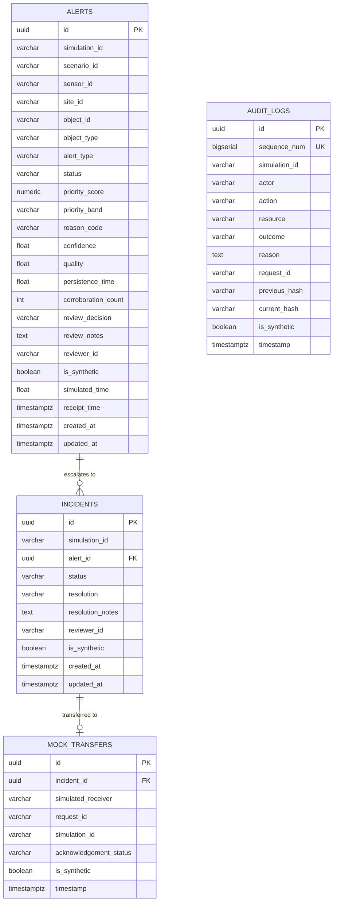

# PHASE V6C — SUPABASE DATABASE FOUNDATION
**Project:** Intelligent Border Video Analytics Platform — Simulation-Only Prototype (IBVAP-SIM / KAAL)  
**Target Project Reference:** `gscwgfxgescmaoodxbht`  
**Execution Date:** 2026-09-24  
**Status:** MIGRATION APPLIED & LIVE DATABASE VALIDATION COMPLETED (10/10 TESTS PASS)

---

## 1. Schema Overview

The Supabase cloud database foundation for IBVAP-SIM / KAAL has been established in project `gscwgfxgescmaoodxbht` using:
[`supabase/migrations/20260924104500_ibvap_cloud_foundation.sql`](file:///Users/sayanmondal/Documents/PROJECTS%20%E2%9C%85/Border_security/New%20IBVAP/supabase/migrations/20260924104500_ibvap_cloud_foundation.sql)

This migration defines the 4 core relational tables, relational foreign keys, performance indexes, Row Level Security (RLS) policies, and the cryptographic SHA-256 audit chaining triggers.



---

## 2. Table Definitions & Constraints

### 2.1 `alerts`
* **Primary Key:** `id UUID DEFAULT gen_random_uuid()`
* **Foreign Keys:** Referenced by `incidents.alert_id`
* **Status Check:** `status IN ('new', 'unacknowledged', 'acknowledged', 'escalated', 'dismissed')`
* **Priority Score Check:** `priority_score >= 0.0 AND priority_score <= 100.0`
* **Priority Band Check:** `priority_band IN ('P1', 'P2', 'P3', 'P4')`
* **Uncertainty & Quality:** `confidence` [0.0, 1.0], `quality` [0.0, 1.0], `persistence_time` $\ge$ 0.0, `corroboration_count` $\ge$ 0.
* **Simulation Boundary:** `is_synthetic BOOLEAN NOT NULL DEFAULT true CHECK (is_synthetic = true)`
* **Indexes Verified:**
  * `idx_alerts_priority (priority_band, priority_score DESC)`
  * `idx_alerts_created_at (created_at DESC)`
  * `idx_alerts_object_id (object_id)`
  * `idx_alerts_status (status)`
  * `idx_alerts_simulation_id (simulation_id)`

### 2.2 `incidents`
* **Primary Key:** `id UUID DEFAULT gen_random_uuid()`
* **Foreign Key:** `alert_id UUID NOT NULL REFERENCES alerts(id) ON DELETE CASCADE`
* **Status Check:** `status IN ('open', 'under_review', 'resolved', 'unresolved', 'transferred', 'closed')`
* **Simulation Boundary:** `is_synthetic BOOLEAN NOT NULL DEFAULT true CHECK (is_synthetic = true)`
* **Indexes Verified:**
  * `idx_incidents_alert_id (alert_id)`
  * `idx_incidents_status (status)`
  * `idx_incidents_created_at (created_at DESC)`

### 2.3 `mock_transfers`
* **Primary Key:** `id UUID DEFAULT gen_random_uuid()`
* **Foreign Key:** `incident_id UUID NOT NULL REFERENCES incidents(id) ON DELETE CASCADE`
* **Simulation Boundary:** `is_synthetic BOOLEAN NOT NULL DEFAULT true CHECK (is_synthetic = true)`
* **Indexes Verified:**
  * `idx_mock_transfers_incident_id (incident_id)`
  * `idx_mock_transfers_timestamp (timestamp DESC)`

### 2.4 `audit_logs`
* **Primary Key:** `id UUID DEFAULT gen_random_uuid()`
* **Strict Monotonic Sequence:** `sequence_num BIGSERIAL UNIQUE NOT NULL`
* **Chain Fields:** `previous_hash VARCHAR(64)`, `current_hash VARCHAR(64) NOT NULL`
* **Simulation Boundary:** `is_synthetic BOOLEAN NOT NULL DEFAULT true CHECK (is_synthetic = true)`
* **Indexes Verified:**
  * `idx_audit_logs_seq (sequence_num ASC)`
  * `idx_audit_logs_timestamp (timestamp DESC)`
  * `idx_audit_logs_sim (simulation_id)`

---

## 3. Row Level Security (RLS) Policy Specification

All 4 tables have RLS enabled and active:

| Table | Policy Name | Command | Target Roles | Policy Expression / Check |
| :--- | :--- | :--- | :--- | :--- |
| `alerts` | `alerts_read_policy` | SELECT | `anon`, `authenticated` | `USING (true)` |
| `alerts` | `alerts_insert_policy` | INSERT | `anon`, `authenticated` | `WITH CHECK (is_synthetic = true)` |
| `alerts` | `alerts_update_policy` | UPDATE | `anon`, `authenticated` | `USING (is_synthetic = true) WITH CHECK (is_synthetic = true)` |
| `incidents` | `incidents_read_policy` | SELECT | `anon`, `authenticated` | `USING (true)` |
| `incidents` | `incidents_insert_policy` | INSERT | `anon`, `authenticated` | `WITH CHECK (is_synthetic = true)` |
| `incidents` | `incidents_update_policy` | UPDATE | `anon`, `authenticated` | `USING (is_synthetic = true) WITH CHECK (is_synthetic = true)` |
| `mock_transfers` | `mock_transfers_read_policy` | SELECT | `anon`, `authenticated` | `USING (true)` |
| `mock_transfers` | `mock_transfers_insert_policy` | INSERT | `anon`, `authenticated` | `WITH CHECK (is_synthetic = true)` |
| `audit_logs` | `audit_logs_read_policy` | SELECT | `anon`, `authenticated` | `USING (true)` |
| `audit_logs` | `audit_logs_insert_policy` | INSERT | `anon`, `authenticated` | `WITH CHECK (is_synthetic = true)` |

> **Immutability Enforcement:**  
> Neither `UPDATE` nor `DELETE` policies exist on `audit_logs`. The trigger `trg_audit_immutable` explicitly raises error `P0001` if an update or delete is attempted.

---

## 4. Cryptographic SHA-256 Audit Chain Implementation

The PostgreSQL function `process_audit_log_entry()` preserves the canonical cryptographic formula from `audit_service.py`:

$$\text{hash} = \text{SHA256}(\text{action} \parallel \text{"\|"} \parallel \text{resource} \parallel \text{"\|"} \parallel \text{outcome} \parallel \text{"\|"} \parallel \text{timestamp\_iso} \parallel \text{"\|"} \parallel (\text{previous\_hash} \lor \text{"GENESIS"}))$$

### Concurrency Lock Guarantee:
```sql
SELECT current_hash INTO prev_h
FROM public.audit_logs
ORDER BY sequence_num DESC
LIMIT 1
FOR UPDATE;
```
This row-level lock serializes concurrent inserts and guarantees that no chain forks can occur under high concurrency.

---

## 5. Strict Realtime Boundary: Ephemeral vs. Persisted

* **NO 4 Hz Telemetry Table:** The live database contains strictly 0 telemetry tables.
* **Architecture Boundary:** Live radar and camera telemetry is transported exclusively via **Supabase Realtime Broadcast Channels** (in-memory pub/sub).
* **Storage Protection:** Preserves the Supabase 500 MB database quota by avoiding the ~1.7 million rows/day generated by 4 Hz radar sweeps.

---

## 6. Live Database Validation Results (Step 11)

All 10 required functional validation tests were executed directly against the live Supabase project `gscwgfxgescmaoodxbht`:

| Test ID | Test Description | Execution Query / Action | Expected Result | Live Result | Status |
| :--- | :--- | :--- | :--- | :--- | :--- |
| **TEST A** | Valid synthetic alert insert | `INSERT INTO alerts (... is_synthetic=true)` | Success with synthetic flag | Returned ID, band P1, is_synthetic=true | **PASS** |
| **TEST B** | Non-synthetic alert insert | `INSERT INTO alerts (... is_synthetic=false)` | Rejected by constraint | Rejected: `violates check constraint "alerts_is_synthetic_check"` | **PASS** |
| **TEST C** | Incident referencing alert | `INSERT INTO incidents (... alert_id=...)` | Success with FK linkage | Linked to alert, status open | **PASS** |
| **TEST D** | Mock transfer referencing incident | `INSERT INTO mock_transfers (... incident_id=...)` | Success with FK linkage | Accepted status, synthetic provenance | **PASS** |
| **TEST E** | Genesis audit insert | `INSERT INTO audit_logs (...)` | Trigger assigns previous_hash='GENESIS' & computes SHA-256 | `sequence_num: 1`, `prev_hash: GENESIS`, SHA-256 computed | **PASS** |
| **TEST F** | Second audit insert | `INSERT INTO audit_logs (...)` | `second.previous_hash == first.current_hash` | Matched `6b48b9d3fa...7ff7dde79`, `seq: 2` | **PASS** |
| **TEST G** | Hash formula verification | Compare `current_hash` against canonical digest query | `hash_matches: true` | Both sequence 1 and 2 hashes match canonical SHA-256 formula | **PASS** |
| **TEST H** | Audit UPDATE attempt | `UPDATE audit_logs SET outcome='tampered'` | Exception raised | Rejected: `P0001: Audit records are cryptographically chained and strictly immutable` | **PASS** |
| **TEST I** | Audit DELETE attempt | `DELETE FROM audit_logs WHERE ...` | Exception raised | Rejected: `P0001: Audit records are cryptographically chained and strictly immutable` | **PASS** |
| **TEST J** | Non-compliant RLS write | `UPDATE alerts SET is_synthetic=false` | Rejected by check/RLS | Rejected: `violates check constraint "alerts_is_synthetic_check"` | **PASS** |

### Test Data Cleanup:
* The temporary test records in `alerts`, `incidents`, and `mock_transfers` were cleanly deleted.
* The two audit validation records in `audit_logs` are preserved as the immutable genesis chain records (`sequence_num: 1` and `2`, with `simulation_id: 'sim_validation_test'` and `is_synthetic: true`).

---

## 7. Local Test Suite Regression Results (Step 12)

* **Backend Tests (`pytest`):** **43 / 43 PASSING (100%)**
  * `test_api.py`: 13 passed
  * `test_concurrency.py`: 7 passed
  * `test_workflows.py`: 1 passed
  * `test_engine.py`: 7 passed
  * `test_models.py`: 3 passed
  * `test_alert_pipeline.py`: 9 passed
  * `test_audit_chain.py`: 2 passed
  * `test_offline_recovery.py`: 1 passed
* **Frontend Production Build:** Built cleanly in 905ms (`tsc -b && vite build` succeeds with 0 errors).
* **Local Mode Integrity:** Local SQLite database (`ibvap.db`) and local FastAPI backend are completely untouched and fully functional.

---

## 8. Remaining Phase V6 Work

* **Phase V6D — Supabase Realtime Broadcast & Client-Side Engine Adapter:**
  * Implement the client-side deterministic simulation Web Worker.
  * Connect `useSimulationSocket` to Supabase Realtime Broadcast channel.
  * Persist alerts and audit logs to Supabase PostgreSQL when running in cloud mode.
* **Phase V6E — Vercel Production Deployment & End-to-End Verification:**
  * Configure environment variables on Vercel (`VITE_SUPABASE_URL`, `VITE_SUPABASE_PUBLISHABLE_KEY`).
  * Deploy frontend to Vercel and verify live simulation, telemetry, and audit trail.
