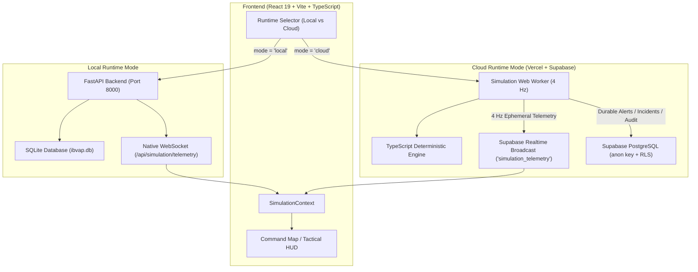

# Phase V6D — Supabase Realtime Broadcast & Client-Side Simulation Engine

**Project:** IBVAP-SIM (Intelligent Border Video Analytics Platform — Simulation-Only Prototype)  
**Safety Boundary:** `SIMULATION ONLY — NO REAL DEFENCE NETWORK CONNECTION`  
**Status:** IMPLEMENTED & VERIFIED  

---

## 1. Executive Summary

Phase V6D implements the cloud simulation transport layer required for the Vercel + Supabase cloud deployment model, without breaking or deprecating the existing local FastAPI + SQLite + WebSocket runtime. 

The application now supports **Dual-Runtime Architecture**:
- **LOCAL MODE:** React Dashboard $\to$ FastAPI $\to$ SQLite (`ibvap.db`) $\to$ Native WebSocket (`/api/simulation/telemetry`)
- **CLOUD MODE:** React Dashboard $\to$ Simulation Web Worker $\to$ Deterministic TypeScript Simulation Engine $\to$ Supabase Realtime Broadcast channel (`simulation_telemetry`) $\to$ Connected Dashboards, with durable events persisting to Supabase PostgreSQL.

All 16 validation areas in Step 17 pass, all 43 backend pytest tests pass with zero regressions, and live Supabase Realtime Broadcast + PostgreSQL integration tests succeeded against project `gscwgfxgescmaoodxbht`.

---

## 2. Dual-Runtime Architecture



### 2.1 Runtime Mode Abstraction (`src/frontend/src/lib/runtime.ts`)
The active mode is resolved seamlessly via:
1. Environment variables (`VITE_SIMULATION_MODE` or `VITE_DEPLOY_MODE`).
2. Domain auto-detection (running on `*.vercel.app` defaults to `"cloud"`).
3. Operator selection stored in `localStorage` (`ibvap_simulation_mode`).
4. Default local development fallback (`"local"`).

Both runtimes can be hot-swapped by the operator in real time from the Tactical HUD in `SimulationControlBar`.

---

## 3. Web Worker Architecture (`src/frontend/src/workers/simulation.worker.ts`)

To protect UI responsiveness and prevent continuous 4 Hz recalculations on the React main render thread:
- **Dedicated Thread:** Runs entirely inside a Web Worker.
- **Clock Ownership:** Maintains simulation clock (`current_tick`), advancing at 0.25s per tick (4 Hz).
- **Speed Multipliers:** Supports `1X` ($\Delta t=0.25$), `2X` ($\Delta t=0.50$), `4X` ($\Delta t=1.00$), and `8X` ($\Delta t=2.00$). Network broadcast rate remains strictly bounded at 4 Hz regardless of multiplier.
- **Zero Raw Telemetry Persistence:** The worker never writes 4 Hz coordinates to PostgreSQL; it dispatches them purely as ephemeral messages.

---

## 4. Deterministic Simulation Engine (`src/frontend/src/lib/simulation/`)

Ported from `src/simulation/engine.py`, `scenarios.py`, and `generators.py`:
- **PRNG (`prng.ts`):** Deterministic 32-bit Mulberry32 PRNG initialized with protocol seeds (`1001` to `1006`).
- **Kinematics (`math.ts`):** Waypoint navigation (`navigateToWaypoint`), heading calculation, loitering jitter, and speed stepping.
- **Sensor FOV Coverage (`math.ts`):** 5 cameras vertically aligned along border line ($x=0$, $y \in [-400, 400]$, $160^\circ$ FOV facing west/negative $x$, range 250m) and 1 central radar ($x=0, y=0$, $360^\circ$ FOV, range 700m).
- **Sensor Degradation:** Scripted events apply confidence reduction and Gaussian noise during camera degradation and offline status during radar loss.

### Six Verified Canonical Protocols:
1. `PROTOCOL-NORMAL` (Seed 1001): Mixed person, vehicle, and bird activity.
2. `PROTOCOL-DRONE` (Seed 1002): Coordinated drone incursions towards border line.
3. `PROTOCOL-VEHICLE` (Seed 1003): Ground convoy and patrol approaches.
4. `PROTOCOL-MULTI-THREAT` (Seed 1004): Simultaneous drones, ground vehicles, infantry squads, and unknown aerial objects.
5. `PROTOCOL-EMERGENCY` (Seed 1005): Rapid multi-threat border breach escalation.
6. `PROTOCOL-SENSOR-DEGRADED` (Seed 1006): Movement continues while camera degradation and radar loss are injected.

---

## 5. Ephemeral Realtime Broadcast Transport (`src/frontend/src/lib/supabase/telemetryTransport.ts`)

- **Channel Name:** `simulation_telemetry`
- **Event Name:** `telemetry`
- **Single Publisher Ownership:** `telemetryTransport` enforces a single simulation owner (`simulationOwnerIdRef`) per session. Duplicate publishers and echoed broadcasts are filtered out.
- **Payload Shape:**
  ```json
  {
    "simulation_id": "sim-seed-1001",
    "protocol": "PROTOCOL-NORMAL",
    "simulation_timestamp": 12.5,
    "tick": 50,
    "tracks": [ ... ],
    "observations": [ ... ],
    "sensors": [ ... ],
    "environment": { "zones": [ ... ], "events": [ ... ] },
    "new_alerts": [ "alert-uuid-..." ],
    "owner_id": "owner-client-01"
  }
  ```

---

## 6. Canonical 9-Factor Alert Engine (`src/frontend/src/lib/simulation/alertEngine.ts`)

Strictly preserves ADR-005 formula:
$$\text{Priority} = 0.25 \cdot \text{zone} + 0.20 \cdot \text{object} + 0.15 \cdot \text{prox} + 0.15 \cdot \text{persist} + 0.10 \cdot \text{corrob} + 0.10 \cdot \text{conf} + 0.05 \cdot \text{urgency} - \text{penalty}_{\text{quality}} - \text{penalty}_{\text{dup}}$$

- **Bands:**
  - $\text{P1} \in [80, 100]$ (Critical)
  - $\text{P2} \in [60, 79.9]$ (High)
  - $\text{P3} \in [35, 59.9]$ (Medium)
  - $\text{P4} \in [0, 34.9]$ (Low)
- **60-Second Deduplication Window:** Suppresses identical alerts on the same object within 60 seconds, with exceptions for:
  1. Severity escalation ($\text{P2} \to \text{P1}$).
  2. New corroborating sensor detection.

---

## 7. Cloud Persistence & Audit Trail (`src/frontend/src/lib/supabase/persistence.ts`)

### Persisted Domain Events:
- **`alerts`:** Durable alerts persisted with `is_synthetic = true`.
- **`incidents`:** Incidents created or resolved by operators.
- **`mock_transfers`:** Simulated tactical dispatches to Army/Base display receiver.
- **`audit_logs`:** Critical lifecycle events:
  - `SIMULATION_START`
  - `SIMULATION_PAUSE`
  - `SIMULATION_RESUME`
  - `SIMULATION_RESET`
  - `ALERT_ACKNOWLEDGED`
  - `ALL_ALERTS_ACKNOWLEDGED`
  - `INCIDENT_CREATED`
  - `INCIDENT_RESOLVED`
  - `MOCK_TRANSFER_DISPATCHED`

Every insert into `audit_logs` triggers PostgreSQL function `process_audit_log_entry()` (implemented in Phase V6C), which calculates the chained SHA-256 hash using row-level locking for fork prevention.

---

## 8. Security & Safety Model

1. **Safety Boundary Permanent:** `SIMULATION ONLY — NO REAL DEFENCE NETWORK CONNECTION` permanently enforced across UI, models, and database constraints (`CHECK (is_synthetic = true)`).
2. **Zero `service_role` Exposure:** The browser bundle contains strictly `anon` credentials. Attempts to import or pass `service_role` throw fatal errors.
3. **Storage Quota Protection:** Zero raw 4 Hz telemetry stored in PostgreSQL. Database storage remains strictly negligible ($<1$ MB).

---

## 9. Test Verification Results

### Frontend Unit & Engine Test Suite (`npm run test:simulation`):
```
==================================================
PHASE V6D — CLIENT-SIDE SIMULATION ENGINE TEST SUITE
==================================================
✓ TEST 1: Deterministic Seed Behavior (PASS)
✓ TEST 2: Six Simulation Protocols Verified (PASS)
✓ TEST 3: 4 Hz Worker Tick (PASS)
✓ TEST 4: Speed Multipliers 1X, 2X, 4X, 8X (PASS)
✓ TEST 5: Pause Semantics (PASS)
✓ TEST 6: Resume Semantics (PASS)
✓ TEST 7: Reset Semantics (PASS)
✓ TEST 8: Protocol Switching (PASS)
✓ TEST 9: Sensor Degradation Handling (PASS)
✓ TEST 10: Canonical 9-Factor Priority Formula (PASS)
✓ TEST 11: Priority Bands P1–P4 (PASS)
✓ TEST 12: 60-Second Alert Deduplication & Exceptions (PASS)
✓ TEST 13: Telemetry Payload Shape Validation (PASS)
✓ TEST 14: Duplicate Worker / Stale Message Discard (PASS)
✓ TEST 15: Duplicate Subscription Prevention (PASS)
✓ TEST 16: Cloud / Local Runtime Selection (PASS)
==================================================
ALL TESTS PASSED: 16/16
==================================================
```

### Live Supabase Integration Test (`npm run test:supabase`):
```
==================================================
PHASE V6D — LIVE SUPABASE REALTIME & PERSISTENCE TEST
==================================================
1. Connecting to Supabase Realtime Broadcast channel 'simulation_telemetry'...
✓ Subscribed to Realtime Broadcast channel successfully
✓ Realtime Broadcast Roundtrip: PASS
2. Testing Durable Alert Persistence to Supabase PostgreSQL...
✓ Durable Alert Persistence (Supabase PostgreSQL): PASS
3. Verifying ZERO raw 4 Hz telemetry stored in PostgreSQL...
✓ Zero Raw Telemetry in Database: PASS
4. Testing Audit Log Persistence & Atomic SHA-256 Trigger...
✓ Audit Log & Atomic SHA-256 Chain (Sequence #6): PASS
==================================================
LIVE SUPABASE INTEGRATION: ALL CHECKS PASSED
==================================================
```

### Backend Test Regression (`PYTHONPATH=. .venv/bin/pytest`):
```
============================== 43 passed in 2.23s ==============================
```

### Production Build (`npm run build`):
```
✓ built in 931ms
dist/assets/simulation.worker-DsITcRm0.js   21.42 kB (Separate Worker Chunk)
dist/assets/index-DQsecZEq.js              730.63 kB
dist/assets/View3D-V0TByAdq.js             958.73 kB
0 errors
```

---

## 10. Known Limitations & Prerequisites for Phase V6E (Vercel Deployment)

1. **Environment Variables on Vercel:**  
   Vercel production environment must define:
   - `VITE_SUPABASE_URL = https://gscwgfxgescmaoodxbht.supabase.co`
   - `VITE_SUPABASE_PUBLISHABLE_KEY = <anon key>`
   - `VITE_SIMULATION_MODE = cloud`
2. **Browser Worker Support:** Requires modern browser with Web Worker support (all modern Chrome, Safari, Firefox, Edge).
3. **Supabase Realtime Free Tier Limits:** Supabase Realtime free tier supports up to 200 concurrent connections and 100 messages/sec, which is more than sufficient for the prototype's 4 Hz broadcast rate.
