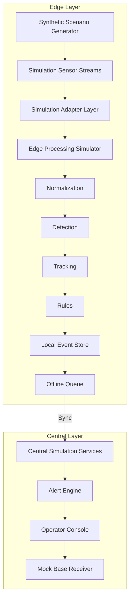

# System Architecture

## A. TARGET SIMULATION ARCHITECTURE (CONCEPTUAL)

This represents the intended, complete design of the simulation pipeline.



## B. CURRENT IMPLEMENTATION ARCHITECTURE

This represents the *actual* code structure existing in the repository today.

```mermaid
flowchart TD
    subgraph Edge Simulation (src/simulation/)
        SG2[Synthetic Scenario Generator\nSTATUS: IMPLEMENTED] --> TRK2[Fused Tracking Output\nSTATUS: IMPLEMENTED]
        TRK2 --> OQ2[Edge Buffer Queue\nSTATUS: IMPLEMENTED]
    end

    subgraph Central Backend (src/backend/)
        OQ2 -- "/api/simulation/sync_events" --> ROUTE[FastAPI Simulation Router\nSTATUS: IMPLEMENTED]
        ROUTE --> AE2[Alert Engine\nSTATUS: IMPLEMENTED]
        AE2 --> SQL[(SQLite DB\nSTATUS: IMPLEMENTED)]
        SQL --> AUD[Audit Service\nSTATUS: IMPLEMENTED]
        AUD -. "Fails on entity_type error" .-> MBR2[Mock Base Receiver Router\nSTATUS: PARTIAL]
    end

    subgraph Frontend Dashboard (src/frontend/)
        ROUTE -. "REST / WS" .-> APP[React Vite App\nSTATUS: IMPLEMENTED]
        APP --> MAP[2D Command Map\nSTATUS: IMPLEMENTED]
        APP --> ALT[Alerts Table\nSTATUS: IMPLEMENTED]
        APP --> HR[Human Review\nSTATUS: MISSING]
        APP --> 3D[3D View\nSTATUS: MISSING]
    end
```

### Component Details
- **Synthetic Scenario Generator (IMPLEMENTED):** Found in `src/simulation/scenarios.py`. Bypasses separate Normalization/Detection layers to output fused tracking events directly.
- **Edge Buffer (IMPLEMENTED):** Simulates offline resilience. Located in `src/simulation/engine.py`.
- **Alert Engine (IMPLEMENTED):** Calculates priority and deduplicates events. Found in `src/backend/alert_engine.py`.
- **SQLite DB (IMPLEMENTED):** Root `ibvap.db`.
- **Audit Service (IMPLEMENTED):** Provides cryptographic hashing.
- **Mock Base Receiver (PARTIAL):** API endpoint exists but is currently failing due to an `AuditLog` bug.
- **3D View / Human Review (MISSING):** UI workflows completely absent.
